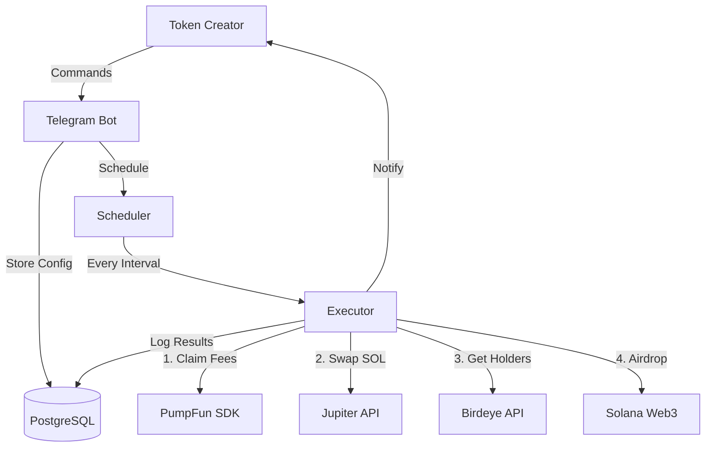

# Boomerang 🪃

Your fees always come back! Automated PumpFun volume fee redistribution bot. Claims fees, buys tokens, and airdrops proportionally to holders.

[](https://opensource.org/licenses/MIT)

## ✨ Features

- 🤖 **Telegram Bot Interface** - Easy setup and management
- 📊 **Public Dashboards** - Live stats at boomerang.com/[your-token]
- 🔐 **AES-256 Encryption** - Secure private key storage
- ⏱️ **Customizable Intervals** - 1, 2, 5, 10, 30, or 60 minutes
- 💰 **Auto Fee Claiming** - Automatic PumpFun fee collection
- 🔄 **Best Swap Prices** - Jupiter Aggregator integration
- 📊 **Real-time Data** - Birdeye API for holder information
- 🎁 **Fair Distribution** - Proportional token airdrops
- 📈 **Complete Logging** - Track every execution

## 🚀 Quick Start

**Get running in under 10 minutes!** See [QUICKSTART.md](QUICKSTART.md)

```bash
# 1. Install dependencies
cd backend && npm install

# 2. Set up environment
cp .env.example .env
# Edit .env with your values

# 3. Run migrations
npm run migrate

# 4. Start the bot
npm run dev
```

## 📖 Documentation

- **[QUICKSTART.md](QUICKSTART.md)** - Get started in 10 minutes
- **[TESTING.md](TESTING.md)** - Complete testing guide for devnet
- **[DEPLOYMENT.md](DEPLOYMENT.md)** - Production deployment guide
- **[SECURITY.md](SECURITY.md)** - Security best practices

## 🏗️ Architecture



## 💻 Tech Stack

**Backend:**
- Node.js + Express
- Telegraf (Telegram)
- @pump-fun/pump-sdk
- @solana/web3.js
- Jupiter Aggregator
- Birdeye API
- Neon PostgreSQL

**Frontend:**
- Next.js 14
- Tailwind CSS
- React 18

## 🔧 Project Structure

```
emissionbot/
├── backend/
│   ├── src/
│   │   ├── bot/           # Telegram bot (commands, keyboards)
│   │   ├── services/      # Core services (PumpFun, Jupiter, etc.)
│   │   ├── scheduler/     # Cron scheduler + executor
│   │   ├── db/            # Database (connection, queries, migrations)
│   │   ├── api/           # REST API endpoints
│   │   └── index.js       # Main entry point
│   └── package.json
├── frontend/
│   ├── app/              # Next.js pages
│   ├── components/       # React components
│   └── package.json
├── README.md             # This file
├── QUICKSTART.md         # Quick start guide
├── TESTING.md            # Testing guide
├── DEPLOYMENT.md         # Deployment guide
└── SECURITY.md           # Security guide
```

## 🎯 How It Works

1. **Setup** - User configures bot via Telegram with:
   - Dev wallet private key (encrypted)
   - Source token address (PumpFun token)
   - Target token address (token to buy & airdrop)
   - Execution interval

2. **Automated Execution** - Bot runs on schedule:
   - Checks for unclaimed PumpFun fees
   - Claims fees to dev wallet
   - Swaps SOL for target token (via Jupiter)
   - Gets current holders (via Birdeye)
   - Calculates proportional distribution
   - Executes batched airdrops

3. **Monitoring** - User receives Telegram notifications:
   - Execution success/failure
   - Amount claimed and distributed
   - Number of holders reached
   - Transaction signatures
   - Link to public dashboard

4. **Public Dashboard** - Every token gets a public page:
   - Live stats and execution history
   - Top recipients leaderboard
   - Total fees claimed and distributed
   - Share with your community for transparency

## 🔐 Security

- **AES-256-GCM encryption** for all private keys
- **Parameterized SQL queries** to prevent injection
- **Rate limiting** on API endpoints
- **SSL/TLS** for all connections
- **No logging** of sensitive data
- **Memory-only** key decryption

See [SECURITY.md](SECURITY.md) for complete security documentation.

## 📊 Database Schema

```sql
users                   # Telegram users
├── id
├── telegram_id
├── username
└── created_at

bot_configs             # Bot configurations
├── id
├── user_id
├── dev_wallet_encrypted  # AES-256 encrypted
├── source_token_address
├── target_token_address
├── interval_minutes
└── is_active

execution_logs          # Execution history
├── id
├── config_id
├── claimed_sol_amount
├── bought_token_amount
├── holder_count
├── status
└── execution_time

airdrop_transactions    # Detailed airdrop records
├── id
├── execution_log_id
├── holder_address
├── airdrop_amount
├── tx_signature
└── status
```

## 🧪 Testing

**Always test on devnet first!**

```bash
# Set up devnet environment
SOLANA_RPC_URL=https://api.devnet.solana.com
SOLANA_NETWORK=devnet

# Get devnet SOL
# Visit: https://faucet.solana.com

# Run tests
npm run dev
```

See [TESTING.md](TESTING.md) for complete testing guide.

## 🚢 Deployment

Deploy to production in 3 steps:

1. **Database** - Neon PostgreSQL (free tier available)
2. **Backend** - Railway or Render ($5-10/month)
3. **Frontend** - Vercel (free)

See [DEPLOYMENT.md](DEPLOYMENT.md) for detailed deployment guide.

## 💡 Usage Example

```bash
# User opens Telegram bot
/start

# Sets up configuration
/setup
> Sends private key (auto-deleted)
> Enters source token: Hfp9...xyz
> Enters target token: So11...112 (SOL)
> Selects interval: 30 minutes

# Bot runs automatically
✅ Execution Complete!
💰 Claimed: 0.5 SOL
💱 Bought: 1,234,567 tokens
👥 Airdropped to: 150/150 holders

# Check status anytime
/status
```

## 🤝 Contributing

Contributions welcome! Please:
1. Fork the repository
2. Create a feature branch
3. Test thoroughly on devnet
4. Submit a pull request

## ⚠️ Disclaimer

This bot handles real funds and private keys. Use at your own risk. Always:
- Test thoroughly on devnet first
- Start with small amounts
- Keep your encryption keys secure
- Monitor executions closely
- Have a backup plan

## 📝 License

MIT License - see [LICENSE](LICENSE) file for details.

## 🔗 Links

- **Pump.fun**: https://pump.fun
- **Jupiter**: https://jup.ag
- **Birdeye**: https://birdeye.so
- **Solana**: https://solana.com
- **Neon**: https://neon.tech

## 📞 Support

For issues or questions:
1. Check documentation first
2. Review logs for errors
3. Test on devnet
4. Open an issue with details

---

**Built with ❤️ for PumpFun token creators on Solana**

Your fees always come back, like a boomerang! 🪃

🚀 [Get Started Now](QUICKSTART.md) | 📖 [Read the Docs](TESTING.md) | 🔐 [Security Guide](SECURITY.md)
