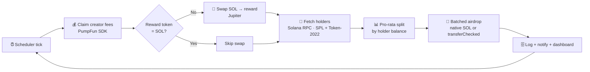

<div align="center">

# Boomerang 🪃

### Your fees always come back.

**Boomerang turns PumpFun creator fees into automatic, on-chain rewards for your holders.**
Claim → swap → airdrop, every few minutes, fully automated. Set it once on Telegram; your community watches it happen on a live public dashboard.

[](https://opensource.org/licenses/MIT)
[](https://solana.com)
[](https://nextjs.org)
[](https://nodejs.org)

</div>

---

## What it does

Every PumpFun token earns **creator fees** in SOL as it trades. Most of that just sits in a vault. Boomerang puts it to work:

1. **🪙 Claims** the unclaimed creator fees from your dev wallet.
2. **🔁 Swaps** them into a reward token of your choice (any SPL / Token-2022 token — or keep it in **SOL**).
3. **🎁 Airdrops** the reward **pro-rata to every holder** of your token.
4. **♻️ Repeats** on your schedule — 2, 5, 10, 30 or 60 minutes — forever.

Holders get paid just for holding. The flywheel rewards holding, holding supports the chart, the chart drives volume, volume generates more fees. Like a boomerang, **it always comes back.**

---

## ✨ Highlights

- 🤖 **Telegram-native setup** — link a token and start rewarding holders in under a minute.
- 🌐 **Live public dashboards** — every token gets `/<mint>` with real-time stats, top recipients, a payout chart, **countdown to the next distribution**, market cap, and **Solscan links** to the actual airdrop transactions.
- 📡 **"Tokens running Boomerang"** — a homepage feed of every live bot, sorted by market cap, with real names + logos.
- 🔗 **No third-party holder API** — holders are read **straight from the Solana RPC**, auto-detecting **classic SPL _and_ Token-2022** mints, and skipping pools / bonding-curve PDAs.
- 💱 **Best-price swaps** via the Jupiter aggregator.
- 💸 **Native-SOL _and_ SPL/Token-2022 airdrops** — decimals-aware, batched, with dust reassigned so nothing is stranded.
- 🔐 **AES-256-GCM** encrypted dev-wallet keys; decrypted in memory only, at execution time.
- 📝 **Full audit trail** — every claim, swap and transfer is logged with signatures.

---

## 🔄 How the loop works



---

## 💻 Tech stack

| Layer | Stack |
|---|---|
| **Backend** | Node.js · Express · Telegraf · `@solana/web3.js` · `@solana/spl-token` · `@pump-fun/pump-sdk` · Jupiter API · `node-cron` |
| **Frontend** | Next.js 14 · React 18 · Tailwind CSS · Recharts |
| **Data** | Neon (PostgreSQL) |
| **Metadata** | Jupiter token API + DexScreener (names, logos, market cap) |
| **Infra** | Helius RPC (mainnet) · Vercel (frontend) |

---

## 🗂️ Project structure

```
boomerang/
├── backend/
│   └── src/
│       ├── bot/            # Telegram bot (commands, keyboards, flows)
│       ├── services/
│       │   ├── pumpfun.js    # claim creator fees
│       │   ├── jupiter.js    # SOL → reward-token swaps
│       │   ├── holders.js    # RPC holder scan (SPL + Token-2022, pool-aware)
│       │   ├── airdrop.js    # native SOL + SPL/Token-2022 distribution
│       │   └── encryption.js # AES-256-GCM key handling
│       ├── scheduler/      # cron + executor (the loop)
│       ├── db/             # Neon connection, queries, migrations
│       └── api/            # REST endpoints
└── frontend/
    ├── app/               # Next.js routes + API (/api/v1/*, dashboards)
    ├── components/        # LiveFeed, ActiveTokens, Countdown, charts…
    └── lib/               # shared queries + token metadata
```

---

## 🚀 Quick start

> Requires Node 20+, a Neon (or any Postgres) database, and a Solana mainnet RPC (e.g. Helius).

```bash
# Backend
cd backend
npm install
cp .env.example .env        # fill in DATABASE_URL, SOLANA_RPC_URL, TELEGRAM_BOT_TOKEN, MASTER_ENCRYPTION_KEY
npm run migrate
npm run dev                 # starts the API + Telegram bot + scheduler

# Frontend
cd ../frontend
npm install
npm run dev                 # http://localhost:3001
```

Generate an encryption key:

```bash
node -e "console.log(require('crypto').randomBytes(32).toString('hex'))"
```

---

## 🔌 Public API

| Endpoint | Description |
|---|---|
| `GET /api/v1/tokens` | All tokens with an active bot (name, logo, market cap, interval, payouts), sorted by market cap |
| `GET /api/v1/stats` | Global stats — users, active bots, total distributions |
| `GET /api/dashboard/<mint>` | Full per-token dashboard data (stats, top recipients, recent runs, reward token + decimals) |
| `GET /api/activity` | Live activity feed with token metadata |

---

## 🔐 Security

- **AES-256-GCM** encryption for every dev-wallet private key; decrypted only in memory, only at execution.
- Parameterized SQL everywhere; secrets live in `.env` (never committed).
- A dev wallet should be **dedicated and disposable** — never your main wallet.

---

## ⚠️ Disclaimer

Boomerang handles real funds and private keys on Solana mainnet. Use at your own risk: start small, use a dedicated dev wallet, keep your `MASTER_ENCRYPTION_KEY` safe, and monitor executions.

---

## 📝 License

MIT — see [LICENSE](LICENSE).

<div align="center">

**Built for PumpFun creators on Solana.**
Your fees always come back, like a boomerang. 🪃

</div>
